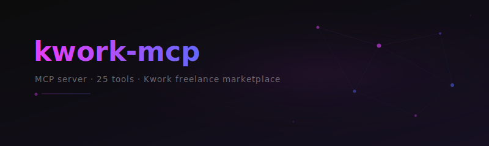

<p align="center">
  
</p>

[](https://github.com/simonether/kwork-mcp/actions/workflows/ci.yml)
[](https://pypi.org/project/kwork-mcp/)
[](https://pypi.org/project/kwork-mcp/)
[](https://www.python.org/downloads/)
[](LICENSE)
[](https://github.com/astral-sh/ruff)
[](https://modelcontextprotocol.io)

MCP server that exposes 25 tools for the [Kwork](https://kwork.ru) freelance marketplace — browse projects, submit offers, manage orders, send messages, and more.

Built with [FastMCP](https://github.com/jlowin/fastmcp) (via [MCP Python SDK](https://github.com/modelcontextprotocol/python-sdk)) and [pykwork](https://github.com/kesha1225/pykwork).

## 🚀 Setup

### Requirements

- [uv](https://docs.astral.sh/uv/)
- Kwork account (login/password or API token)

### Install

When using `uv` no specific installation is needed. We will use [`uvx`](https://docs.astral.sh/uv/guides/tools/) to directly run kwork-mcp.

Alternatively, install via pip:

```bash
pip install kwork-mcp
```

Or from source:

```bash
git clone https://github.com/simonether/kwork-mcp.git
cd kwork-mcp
uv sync
```

### Configure

| Variable | Required | Default | Description |
|---|---|---|---|
| `KWORK_LOGIN` | yes* | — | Kwork login |
| `KWORK_PASSWORD` | yes* | — | Kwork password |
| `KWORK_TOKEN` | yes* | — | Auth token (skips login) |
| `KWORK_PHONE_LAST` | no | — | Last 4 digits of phone (2FA) |
| `KWORK_PROXY_URL` | no | — | SOCKS5 proxy |
| `KWORK_RPS_LIMIT` | no | `2` | Requests per second |
| `KWORK_BURST_LIMIT` | no | `5` | Burst limit |
| `KWORK_TOKEN_FILE` | no | `~/.kwork_token` | Token persistence path |

\*Either `KWORK_TOKEN` or both `KWORK_LOGIN` + `KWORK_PASSWORD`.

Auth priority: `KWORK_TOKEN` env → saved token file → fresh login.

## 💡 Usage

### Claude Desktop

Add to `claude_desktop_config.json`:

```json
{
  "mcpServers": {
    "kwork": {
      "command": "uvx",
      "args": ["kwork-mcp"],
      "env": {
        "KWORK_LOGIN": "your_login",
        "KWORK_PASSWORD": "your_password"
      }
    }
  }
}
```

### Claude Code

```bash
claude mcp add kwork -e KWORK_LOGIN=your_login -e KWORK_PASSWORD=your_password -- uvx kwork-mcp
```

### VS Code

Add to `.vscode/mcp.json`:

```json
{
  "mcp": {
    "servers": {
      "kwork": {
        "command": "uvx",
        "args": ["kwork-mcp"],
        "env": {
          "KWORK_LOGIN": "your_login",
          "KWORK_PASSWORD": "your_password"
        }
      }
    }
  }
}
```

### stdio

```bash
uvx kwork-mcp
```

## 🛠 Tools

<details>
<summary><strong>Profile</strong> (3 tools)</summary>

| Tool | Description |
|---|---|
| `get_me` | Current user profile, rating, balance |
| `get_connects` | Connect count for exchange offers |
| `get_user_info` | Public user info by ID |

</details>

<details>
<summary><strong>Projects</strong> (4 tools)</summary>

| Tool | Description |
|---|---|
| `list_projects` | Browse exchange projects with filters |
| `get_project` | Project details by ID |
| `search_projects` | Search by text query |
| `get_exchange_info` | Exchange marketplace stats |

</details>

<details>
<summary><strong>Offers</strong> (4 tools)</summary>

| Tool | Description |
|---|---|
| `list_my_offers` | Your exchange offers |
| `get_offer` | Offer details by ID |
| `submit_offer` | Submit offer to a project (costs 1 connect) |
| `delete_offer` | Delete an offer |

</details>

<details>
<summary><strong>Orders</strong> (3 tools)</summary>

| Tool | Description |
|---|---|
| `list_worker_orders` | Seller orders (all statuses) |
| `get_order_details` | Order details by ID |
| `send_order_for_approval` | Submit work for buyer review |

</details>

<details>
<summary><strong>Dialogs</strong> (4 tools)</summary>

| Tool | Description |
|---|---|
| `list_dialogs` | Conversations with latest messages |
| `get_dialog` | Messages by username |
| `send_message` | Send direct message |
| `mark_dialog_read` | Mark as read |

</details>

<details>
<summary><strong>Kworks</strong> (4 tools)</summary>

| Tool | Description |
|---|---|
| `list_my_kworks` | Your services grouped by status |
| `get_kwork_details` | Kwork details by ID |
| `start_kwork` | Activate a paused kwork |
| `pause_kwork` | Pause an active kwork |

</details>

<details>
<summary><strong>Categories</strong> (2 tools)</summary>

| Tool | Description |
|---|---|
| `list_categories` | Full category tree |
| `get_favorite_categories` | User's favorite categories |

</details>

<details>
<summary><strong>Notifications</strong> (1 tool)</summary>

| Tool | Description |
|---|---|
| `list_notifications` | User notifications |

</details>

## 🧑‍💻 Development

```bash
uv sync --dev
uv run python -m pytest tests/ -x -v
uv run ruff check .
uv run ruff format --check .
```

## License

[MIT](LICENSE)
