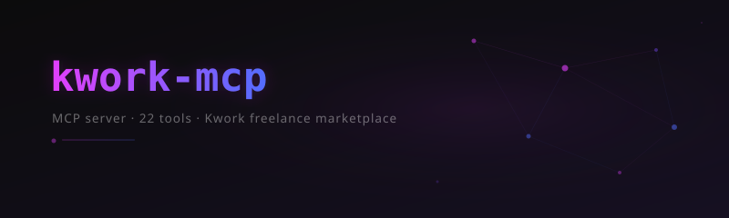

<p align="center">
  
</p>

[](https://github.com/simonether/kwork-mcp/actions/workflows/ci.yml)
[](https://pypi.org/project/kwork-mcp/)
[](https://www.python.org/downloads/)
[](LICENSE)

`kwork-mcp` 1.0 — production-grade stdio MCP-шлюз к Kwork для работы из Codex. Он
даёт типизированные read-результаты, проверяет фактический аккаунт, координирует
лимиты между процессами и проводит все записи через durable `prepare → commit →
reconcile`.

Это breaking redesign. Для миграции с 0.2.x см.
[руководство по миграции](docs/migration-1.0.md).

## Что гарантирует шлюз

- `structuredContent` соответствует объявленному `outputSchema`; текстовый `content`
  сохраняет краткое резюме и JSON-копию результата.
- Read-операции различают `known_data`, `known_empty` и `unknown_error`; ошибки
  возвращаются с `isError=true` и стабильным кодом.
- Перед каждым write заново проверяются `KWORK_EXPECTED_USER_ID` и фактический
  аккаунт. Без `KWORK_ENABLE_WRITES=true` запись невозможна.
- Точный payload, его SHA-256, TTL, confirmation token и idempotency key связаны в
  общем SQLite ledger. Одну операцию выполняет только один процесс.
- Неоднозначный результат записи не повторяется автоматически: состояние
  `submission_unknown` требует `reconcile_write`.
- Лимиты account/route, защита от burst и circuit breaker общие для всех процессов,
  использующих один `KWORK_STATE_DIR`; fingerprint общей policy не позволяет
  процессу с другими лимитами ослабить координацию.
- `kwork==0.2.0` закреплён; сигнатуры и generic routes проверяются fail-loud при
  старте и contract-тестами.
- Token и optional proxy сохраняются в account-scoped файлах с `0700/0600`,
  `flock`, проверкой всей ancestor chain, `O_NOFOLLOW`/FD-anchored traversal и
  atomic replace. Runtime-discovered credentials динамически редактируются в логах
  и внешних данных.
- Тексты проектов, профилей, сообщений и уведомлений помечаются
  `external_untrusted` и не являются инструкциями для агента.

## Установка

Требуются Python 3.12–3.14 и [uv](https://docs.astral.sh/uv/).

```bash
uvx --from kwork-mcp==1.0.0rc1 kwork-mcp-bootstrap --help
```

Из исходников:

```bash
git clone https://github.com/simonether/kwork-mcp.git
cd kwork-mcp
uv sync --locked --dev
uv run kwork-mcp-bootstrap --help
```

`kwork-mcp` использует только stdio. Все его логи идут в stderr; stdout
зарезервирован для MCP JSON-RPC. `kwork-mcp-bootstrap` — отдельная human CLI и не
является MCP transport.

## Безопасная конфигурация

Обычный сервер работает без login/password/token/proxy в конфигурации host.
Единственный поддерживаемый production flow:

1. Узнайте стабильный numeric `user_id` своего аккаунта из настроек/профиля Kwork.
2. Один раз запустите bootstrap из настоящего terminal TTY:

```bash
KWORK_EXPECTED_USER_ID=123456 \
  uvx --from kwork-mcp==1.0.0rc1 kwork-mcp-bootstrap
```

CLI скрыто запросит login/password, optional phone digits и optional proxy URL,
вызовет только auth + `get_me`, сверит точный `user_id` и атомарно запишет
account-bound credential record. Если существует legacy `~/.kwork_token`, CLI
предложит явный validated import: только regular file текущего владельца с mode
`0600`, без symlink. Legacy-файл после успешного импорта намеренно остаётся на
месте, чтобы удаление было отдельным осознанным действием.

3. Запускайте normal MCP только с безопасными steady-state ключами:

```bash
export KWORK_EXPECTED_USER_ID='123456'
export KWORK_PERSIST_TOKEN='true'
export KWORK_ENABLE_WRITES='false'
uvx --from kwork-mcp==1.0.0rc1 kwork-mcp
```

Normal entrypoint fail-closed отклоняет `KWORK_LOGIN`, `KWORK_PASSWORD`,
`KWORK_TOKEN`, `KWORK_PHONE_LAST` и `KWORK_PROXY_URL`, даже если они пришли через
environment. Не помещайте эти значения в Codex/Claude MCP config: некоторые hosts
встраивают env map в собственный process argv. `.env` из cwd никогда не
загружается. Secret values не принимаются через argv.

После запуска вызовите `account_status` и сверьте `user_id`. Только затем включайте
`KWORK_ENABLE_WRITES=true`. `KWORK_EXPECTED_USERNAME` — дополнительная, более
хрупкая проверка: username может быть переименован, primary identity — numeric ID.

По умолчанию состояние хранится в
`$XDG_STATE_HOME/kwork-mcp` либо `~/.local/state/kwork-mcp`. Это каталог с токенами
и `coordination.sqlite3`; все процессы одного аккаунта должны использовать один
локальный `KWORK_STATE_DIR` и одинаковые shared rate/circuit/write settings.
Несовместимый fingerprint отклоняется fail-loud. Файлы содержат чувствительные
данные и не зашифрованы самим приложением — используйте защищённую учётную запись
ОС и шифрование диска. Вся физическая ancestor chain должна принадлежать текущему
user либо root и не быть group/other-writable. Разрешён один стандартный sticky
temp boundary (например, `/tmp`), после которого gateway создаёт private `0700`
каталог; обычный `0777` parent, чужой owner, final symlink или подмена компонента
отклоняются.
Версия 1.0 использует POSIX `fcntl`/`flock` и поддерживает Linux/macOS, но не
Windows.

Optional proxy вводится только bootstrap-команде и сохраняется рядом с token в
защищённом account record; normal server не принимает `KWORK_PROXY_URL`. Legacy
record без proxy означает прямое подключение. Чтобы добавить, заменить или удалить
proxy либо обновить истёкшую сессию, остановите процессы этого account/state,
повторите bootstrap и перезапустите MCP. Файл защищён правами ОС, но не шифруется
на уровне приложения.

Полный справочник: [docs/configuration.md](docs/configuration.md).

## Подключение к Codex

Сначала выполните bootstrap в обычном терминале, как показано выше. Затем добавьте
в `~/.codex/config.toml` только безопасные значения:

```toml
[mcp_servers.kwork]
command = "uvx"
args = ["--from", "kwork-mcp==1.0.0rc1", "kwork-mcp"]

[mcp_servers.kwork.env]
KWORK_EXPECTED_USER_ID = "123456"
KWORK_PERSIST_TOKEN = "true"
KWORK_ENABLE_WRITES = "false"
```

Для локальной checkout-версии:

```toml
[mcp_servers.kwork]
command = "uv"
args = ["--directory", "/absolute/path/to/kwork-mcp", "run", "kwork-mcp"]

[mcp_servers.kwork.env]
KWORK_EXPECTED_USER_ID = "123456"
KWORK_PERSIST_TOKEN = "true"
KWORK_ENABLE_WRITES = "false"
```

Codex CLI, IDE extension и desktop app используют общую MCP-конфигурацию host.
После изменения перезапустите соответствующий клиент и вызовите `account_status`.
Никогда не добавляйте туда token/login/password/phone/proxy — ни как `env`, ни как
`env_vars`, ни как arguments.

## MCP tools

### Read-only

| Tool | Результат |
|---|---|
| `account_status` | Фактический account ID, binding и готовность writes |
| `get_connects` | Активные и общие коннекты |
| `get_user_info`, `search_users` | Профиль/поиск пользователей |
| `discover_projects` | `favorites`, `all` или `category_ids`, фильтры и opaque cursor |
| `get_project`, `get_exchange_info` | Проект и полная exchange-информация |
| `list_my_offers`, `get_offer` | Офферы с обязательными `offer_id` и `project_id` |
| `list_worker_orders`, `get_order_details` | Заказы продавца и полные details |
| `list_dialogs`, `get_dialog` | Диалоги и сообщения |
| `list_my_kworks`, `get_kwork_details` | Собственные кворки |
| `list_categories`, `list_favorite_categories` | Категории |
| `list_notifications` | Полные группы уведомлений |

`discover_projects` не смешивает режимы:

- `favorites` — избранные категории аккаунта;
- `all` — вся биржа;
- `category_ids` — обязательный непустой список ID.

Возвращаемый `PageInfo` содержит `next_cursor`, `query_fingerprint` и
`high_watermark`. Cursor подписан и привязан к подтверждённому аккаунту и точным
фильтрам. Watermark позволяет клиенту вести локальную точку наблюдения для
будущего delta polling, но 1.0 не обещает отдельный delta endpoint.

### Safe write-flow

Поддерживаемые `request.action`: `submit_offer`, `delete_offer`, `send_message`,
`edit_message`, `delete_message`, `mark_dialog_read`, `submit_order_approval`,
`set_kwork_state`.

1. Вызовите `prepare_write` с точным request и собственным стабильным
   `idempotency_key`.
2. Проверьте возвращённые `payload`, `payload_hash`, account ID и `expires_at`.
3. Передайте неизменённые `write_id`, `payload_hash` и `confirmation_token` в
   `commit_write`.
4. Если state равен `submission_unknown`, не вызывайте commit повторно. После
   visibility window вызовите `reconcile_write(write_id)`.
5. `get_write_status` читает durable ledger без remote write.

Пример payload для подготовки оффера:

```json
{
  "request": {
    "action": "submit_offer",
    "project_id": 123,
    "title": "Точное название предложения",
    "description": "Описание длиной не менее 150 символов, соответствующее проекту и не содержащее секретов.",
    "price": 10000,
    "duration_days": 5
  },
  "idempotency_key": "project-123-offer-v1"
}
```

Remote write никогда не retry автоматически. Повторный `prepare_write` с тем же
idempotency key и другим request возвращает `idempotency_conflict`; пока исходная
запись остаётся `prepared`, точный replay того же request возвращает ту же запись и
тот же HMAC-derived confirmation token. Это позволяет безопасно восстановиться
после потери ответа `prepare`, не создавая второй intent. После claim/terminal state
confirmation token больше не выдаётся; состояние читается через
`get_write_status`.

## Модель результата и ошибок

Каждый tool возвращает envelope версии `1.0`:

```json
{
  "schema_version": "1.0",
  "knowledge_state": "known_data",
  "summary": "…",
  "data": {},
  "error": null,
  "meta": {
    "source": "kwork",
    "content_trust": "external_untrusted",
    "observed_at": "…",
    "correlation_id": "…",
    "upstream_contract": "kwork==0.2.0"
  }
}
```

Коды ошибок и retry/reconciliation semantics описаны в
[docs/security.md](docs/security.md#error-taxonomy).
Неизвестное имя tool является protocol-level JSON-RPC `-32602`, а не обычным
`isError` business-result; имя из недоверенного запроса намеренно не отражается в
сообщении.

## Архитектура и границы

Шлюз отвечает за MCP transport, авторизацию Kwork, account binding, корректность
upstream-контракта, типизацию данных и безопасную доставку write-запроса. Он
намеренно не содержит скоринг проектов, Notion, Telegram, email, CRM и другую
pipeline/business logic.

MCP Tasks отключены. Стабильная спецификация считает их экспериментальными, а
Codex-клиенту для коротких Kwork API-вызовов durable task lifecycle не даёт пользы.
Durability write-flow реализована внутри ledger и доступна обычными tools без
нестабильного protocol surface.

Подробнее: [архитектура](docs/architecture.md) и
[security model](docs/security.md).

## Разработка

```bash
uv sync --locked --dev
uv run ruff check .
uv run ruff format --check .
uv run mypy
uv run pytest tests/ -v --cov=kwork_mcp --cov-report=term-missing
uv build
uv run twine check dist/*
uv run check-wheel-contents dist/*.whl
```

Coverage gate — 92% branch-aware покрытия. CI дополнительно проверяет Python
3.12–3.14, зависимости, секреты, pinned MCP Registry schema, wheel install smoke
и согласованность версий.

## Лицензия

[MIT](LICENSE)

<!-- mcp-name: io.github.simonether/kwork-mcp -->
