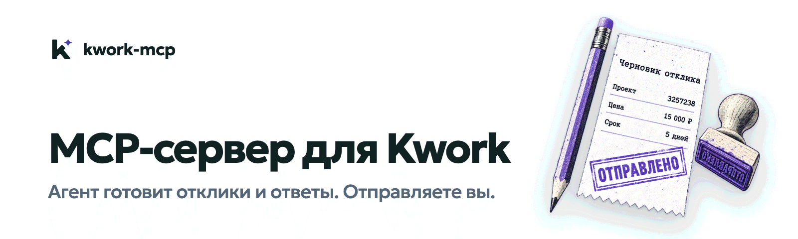

<p align="center">
  <picture>
    <source media="(prefers-color-scheme: dark)" srcset="assets/banner-dark.png">
    
  </picture>
</p>

[](https://github.com/simonether/kwork-mcp/actions/workflows/ci.yml)
[](https://pypi.org/project/kwork-mcp/)
[](https://www.python.org/downloads/)
[](LICENSE)

`kwork-mcp` подключает ваш аккаунт [Kwork](https://kwork.ru) к ИИ-агенту: Claude
Code, Claude Desktop, Codex, Cursor и другим MCP-клиентам. Агент ищет проекты на
бирже, читает диалоги, заказы и офферы, готовит отклики. Отправить что-то на Kwork
он может только если вы включили запись, и только после вашего подтверждения.

Сайт проекта: [simonether.github.io/kwork-mcp](https://simonether.github.io/kwork-mcp/).

## Что можно попросить у агента

- «Найди свежие проекты про Telegram-ботов с бюджетом от 20 000 ₽ и скажи, какие
  мне подходят».
- «Покажи диалоги с непрочитанными сообщениями и предложи ответы».
- «Что с моими заказами? Где что-то ждёт моих действий?»
- «Сколько у меня коннектов и какие мои отклики ещё висят?»
- «Подготовь отклик на проект 3257238: 15 000 ₽, 5 дней» — агент покажет точный
  текст и цену и отправит только после вашего «да».

## Быстрый старт

Нужны macOS или Linux, Python 3.12–3.14 и [uv](https://docs.astral.sh/uv/).
Windows не поддерживается.

### 1. Войдите в Kwork (один раз)

В обычном терминале:

```bash
uvx kwork-mcp@1.4.0 login
```

Команда скрыто спросит логин и пароль Kwork, а также, по желанию, последние 4 цифры
телефона и прокси, и покажет найденный аккаунт:

```text
Найден аккаунт Kwork: your_name (user_id=123456). Привязать его? [y/N]: да
```

После подтверждения токен сохраняется в защищённое хранилище на вашем компьютере
(`~/.local/state/kwork-mcp`). Логин и пароль нигде не сохраняются. В конце команда
напечатает готовые команды подключения для Claude Code и Codex и блок для Claude
Desktop и Cursor.

### 2. Подключите агента

**Claude Code:**

```bash
claude mcp add kwork --scope user -- uvx kwork-mcp@1.4.0
```

**Codex:**

```bash
codex mcp add kwork -- uvx kwork-mcp@1.4.0
```

**Cursor:** [](https://cursor.com/install-mcp?name=kwork&config=eyJjb21tYW5kIjoidXZ4IiwiYXJncyI6WyJrd29yay1tY3BAMS40LjAiXX0%3D)

<details>
<summary><b>Claude Desktop и другие клиенты</b></summary>

Claude Desktop: Settings → Developer → Edit Config, файл `claude_desktop_config.json`.
Cursor без кнопки: `~/.cursor/mcp.json` или `.cursor/mcp.json` проекта.

```json
{
  "mcpServers": {
    "kwork": {
      "command": "uvx",
      "args": ["kwork-mcp@1.4.0"]
    }
  }
}
```

Claude Desktop не видит `uvx` из терминала, поэтому возьмите блок из вывода `login`:
в нём уже указан полный путь к `uvx`.
</details>

Сервер сам найдёт аккаунт, с которым вы вошли. Если вы входили в несколько
аккаунтов, укажите нужный: `-e KWORK_EXPECTED_USER_ID=123456` или блок `"env"` в
JSON.

Логин, пароль, токен и прокси в конфиг клиента не добавляйте: сервер с ними
откажется запускаться.

### 3. Проверьте

Перезапустите клиент и попросите агента: «проверь статус аккаунта Kwork». Он
вызовет `account_status` и покажет ваш `user_id` и имя.

Без клиента то же видно в терминале: `uvx kwork-mcp@1.4.0 status` покажет, с каким
аккаунтом и сайтом запустится сервер, не обращаясь к Kwork. Сменить аккаунт:
`uvx kwork-mcp@1.4.0 logout`, затем снова `login`.

## Отправка откликов и сообщений

По умолчанию агент только читает. Чтобы он мог отправлять отклики и сообщения,
удалять офферы и менять статус кворков, добавьте в конфиг клиента
`KWORK_ENABLE_WRITES=true` и перезапустите клиент. Для Claude Code:

```bash
claude mcp remove kwork --scope user
claude mcp add kwork --scope user -e KWORK_ENABLE_WRITES=true -- uvx kwork-mcp@1.4.0
```

Каждая запись идёт в два шага. Сначала агент готовит точный запрос (текст, цену,
получателя) и показывает его вам. Только после вашего подтверждения запрос уходит
на Kwork. Сервер помнит каждую запись и никогда не повторяет её сам.

Если связь оборвалась в момент отправки, результат становится «неизвестным», и
агент сверяет его с Kwork, прежде чем делать что-то ещё. Пока такая запись не
сверена, новые отправки для аккаунта заблокированы, чтобы не создать дубль.

## kwork.com

По умолчанию сервер работает с kwork.ru. Для kwork.com добавьте в конфиг клиента
`KWORK_SITE=com`. Например, для Claude Code вторым сервером рядом с kwork.ru:

```bash
claude mcp add kwork-com --scope user -e KWORK_SITE=com -- uvx kwork-mcp@1.4.0
```

Аккаунт и токен у kwork.ru и kwork.com общие, поэтому заново входить не нужно.
Биржи проектов на kwork.com нет: поиск проектов, избранные категории и отклик на
проект там отвечают `site_unsupported`. Диалоги, заказы и кворки работают как
обычно, но заказы у каждого сайта свои. Запись, подготовленную для одного сайта,
отправляет и сверяет только сервер того же сайта.

## Если что-то не работает

| Что видите | Что делать |
|---|---|
| `auth_required` или `auth_expired` | Токен отсутствует или истёк: снова выполните `uvx kwork-mcp@1.4.0 login` и перезапустите клиент |
| Сервер не стартует: «аккаунт Kwork не подключён» | Выполните `uvx kwork-mcp@1.4.0 login` |
| Сервер не стартует: «подключено несколько аккаунтов Kwork» | Укажите нужный аккаунт в `KWORK_EXPECTED_USER_ID` или удалите лишний вход: `uvx kwork-mcp@1.4.0 logout <user_id>` |
| Непонятно, какой аккаунт и сайт использует сервер | `uvx kwork-mcp@1.4.0 status` покажет это без запросов к Kwork |
| Сервер не стартует, «некорректная конфигурация: …» | Проверьте названные переменные `KWORK_*` в конфиге клиента |
| `captcha` | Войдите в Kwork в браузере, пройдите капчу, затем повторите `login` |
| Claude Desktop не видит сервер | Возьмите блок для Claude Desktop из вывода `login` (в нём полный путь к `uvx`) или укажите путь из `which uvx`, затем перезапустите приложение |
| `ambiguous_write` с `related_write_id` | Отправка с неизвестным результатом блокирует новые. Попросите агента выполнить `reconcile_write` для этого ID |
| Сверка долго не сходится | Проверьте операцию на сайте Kwork, указанном в поле `site` у `pending-writes`, и зафиксируйте исход вручную (команды ниже) |

Ручная фиксация исхода запускается с теми же `KWORK_*` переменными, что у сервера:

```bash
uvx kwork-mcp@1.4.0 pending-writes
uvx kwork-mcp@1.4.0 resolve-write <write_id> succeeded   # операция на Kwork прошла
uvx kwork-mcp@1.4.0 resolve-write <write_id> absent      # операции на Kwork нет
```

## Инструменты

**Чтение:**

| Инструмент | Что делает |
|---|---|
| `account_status` | Какой аккаунт подключён, включена ли запись, есть ли несверенные отправки |
| `get_connects` | Баланс коннектов |
| `discover_projects`, `get_project` | Проекты биржи: избранные категории, вся биржа или выбранные категории, фильтры по цене и откликам |
| `get_exchange_info` | Сводка по бирже |
| `list_my_offers`, `get_offer` | Ваши отклики |
| `list_worker_orders`, `get_order_details` | Ваши заказы как продавца |
| `list_dialogs`, `get_dialog` | Диалоги и сообщения |
| `list_my_kworks`, `get_kwork_details` | Ваши кворки |
| `get_user_info`, `search_users` | Профили пользователей |
| `list_categories`, `list_favorite_categories` | Категории |
| `list_notifications` | Уведомления |

**Запись:** `prepare_write` → `commit_write`, а также `get_write_status` и
`reconcile_write`. Поддерживаются отклик на проект, удаление отклика, отправка,
правка и удаление сообщения, отметка диалога прочитанным, сдача заказа на проверку
и запуск или пауза кворка.

## Безопасность

- Логин, пароль и прокси вводятся только в `kwork-mcp login` через скрытый ввод
  и не попадают в конфиг клиента.
- Сервер работает только с аккаунтом, который вы подтвердили при входе (если
  аккаунтов несколько, с указанным в `KWORK_EXPECTED_USER_ID`), и проверяет его
  перед каждой записью.
- Тексты проектов, профилей и сообщений помечаются как внешние данные, а не
  инструкции для агента.
- Токен лежит в файлах с правами `0600`. Приложение их не шифрует, поэтому
  используйте шифрование диска.
- Лимиты запросов к Kwork общие для всех процессов одного аккаунта.

Подробно: [модель безопасности](docs/security.md), [настройки](docs/configuration.md),
[архитектура](docs/architecture.md), [переход с 0.2.x](docs/migration-1.0.md).

## Разработка

```bash
git clone https://github.com/simonether/kwork-mcp.git
cd kwork-mcp
uv sync --locked --dev
uv run ruff check . && uv run ruff format --check .
uv run mypy
uv run pytest tests/ -q --cov=kwork_mcp
```

Для запуска из исходников в конфиге клиента используйте
`uv --directory /path/to/kwork-mcp run kwork-mcp` вместо `uvx`. Правила для
изменений и устройство кода описаны в [AGENTS.md](AGENTS.md).

## Лицензия

[MIT](LICENSE)

<!-- mcp-name: io.github.simonether/kwork-mcp -->
