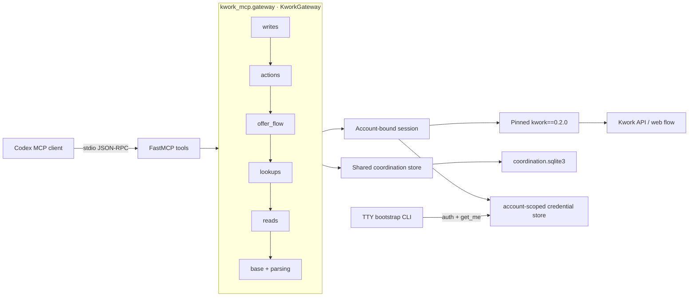
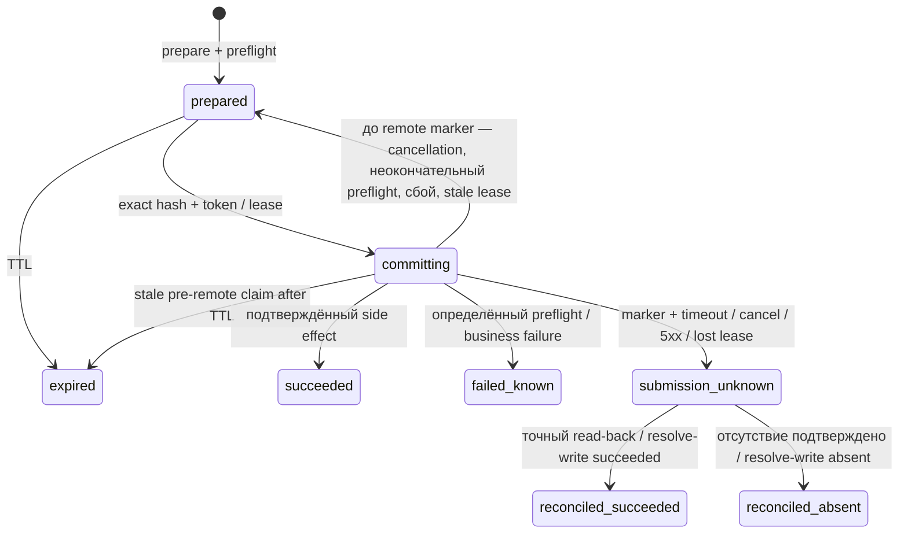

# Архитектура kwork-mcp 1.0

## Слои

- **MCP tools** задают стабильные input/output schemas, annotations, `isError` и
  человекочитаемое резюме.
- **Gateway** — package `src/kwork_mcp/gateway/`; каждый слой опирается только на
  предыдущие:
  - `parsing` — чистые helpers для envelope, paging и scalars;
  - `base` — общее состояние (config, coordinator, session, cursor codec);
  - `reads` — typed reads: стабильные ID, санитизированный raw envelope generic
    routes и все поля закреплённых typed models;
  - `lookups` — исчерпывающие paginated scans для preflight и read-back;
  - `offer_flow` — multi-step web flow отправки оффера;
  - `actions` — по одному handler на write action: `preflight`, `execute`,
    `read_back`, `check_fresh_resolution`;
  - `writes` — durable prepare → commit → reconcile protocol.

  `KworkGateway` в `gateway/__init__.py` объединяет reads и write protocol.
- **Bootstrap CLI** изолирован от stdio MCP, получает secrets через `getpass`,
  координируется с active writer и атомарно заменяет record только после `get_me`.
  Operator-команды `pending-writes` и `resolve-write` работают с тем же ledger.
- **Session** загружает account-bound token/optional proxy, проверяет `get_me` и
  разделяет retry-политику read/write.
- **Coordination store** — общий SQLite ledger для token buckets, circuits,
  cursor-HMAC secret, idempotency, write leases и reconciliation observations.
  Fingerprint общей rate/circuit/write policy закрепляется в metadata: процесс с
  несовместимой конфигурацией того же state directory завершается fail-loud.
- **Secure credential store** атомарно сохраняет account-scoped session token и
  optional proxy URL под межпроцессным `flock`.
- **Upstream adapter** фиксирует `kwork==0.2.0`, ограничивает generic route params и
  сохраняет error payloads, которые исходная библиотека могла потерять.

## Идентичность и сессия

Production server startup принимает только stable `KWORK_EXPECTED_USER_ID` и
account-scoped store. Record проверяется локально на scope/user ID до network, а
token подтверждается через `get_me`. Rejected token запоминается по hash на срок
session и не проверяется циклически; другой token, записанный bootstrap/peer
процессом, может быть принят после своей identity check. Username в record —
обновляемая metadata, numeric ID — primary identity.

Fresh password login и legacy import существуют только в отдельном TTY bootstrap.
Bootstrap берёт lock в порядке `account writer → credential flock`, участвует в
shared route limiter/circuit для `signIn`/`actor`, не удаляет старый record до
успешной проверки и сохраняет optional proxy вместе с token. Normal server не
имеет интерактивного fallback: missing store даёт `auth_required`, rejected token
— `auth_expired`.

Первый подтверждённый `user_id` закрепляется на срок жизни process: ни 401, ни
peer rotation не могут незаметно переключить MCP на другой account. Writes требуют:

1. `KWORK_ENABLE_WRITES=true`;
2. `KWORK_EXPECTED_USER_ID`;
3. соответствие свежего `get_me` ожидаемому ID;
4. соответствие `KWORK_EXPECTED_USERNAME`, если он задан.

Проверка повторяется и на `prepare_write`, и непосредственно перед remote write.
Граница едина для console entrypoint и публичного `create_server(config=...)`:
оба fail-closed отклоняют token/login/password/phone/proxy и требуют
`EXPECTED_USER_ID + PERSIST_TOKEN=true`. Bootstrap использует отдельную
конфигурацию/функцию и не может быть случайно включён через MCP factory. Console
entrypoint валидирует конфигурацию в `main()` до создания server (exit `2` с
именами некорректных `KWORK_*`) и запускает FastMCP с `show_banner=False`, т.е. без
PyPI update check.

Credential save использует private tempfile, file `fsync`, atomic `os.replace` и
directory `fsync`. До replace любая ошибка оставляет старый record побайтно
прежним. Ошибка после replace не может честно обещать rollback и возвращается как
`credential_update_unknown`; caller должен проверить фактически видимый record.
Cancellation во время последующего освобождения token/account locks не маскирует
эту typed ambiguity; если store уже committed, даже первая такая cancellation
классифицируется тем же кодом. Release exception имеет более низкий precedence,
чем любая активная body error, а cleanup ожидание ограничено deadline. Если body
успешен и release после commit падает, bootstrap возвращает sanitized
`credential_update_unknown`.
Runtime-loaded token/proxy и proxy userinfo динамически регистрируются для
sanitization и log redaction.

State root открывается через проверенную FD-цепочку. Каждый физический ancestor
должен принадлежать root/current user и не быть group/other-writable; разрешён
ровно один sticky shared temp boundary. Trusted non-final symlink раскрывается
по одному `readlink` hop с повторным обходом и loop limit, поэтому target не может
скрыть writable intermediate alias. Missing tail создаётся и открывается только
через `mkdirat/openat(O_NOFOLLOW)`; final directory обязан быть current-owned
exact `0700`.

## Межпроцессная координация

SQLite открывается с `WAL`, `synchronous=FULL`, `busy_timeout` и короткими
`BEGIN IMMEDIATE` транзакциями. Сетевой I/O и ожидание token bucket не выполняются
внутри транзакции.

Два token bucket ограничивают каждый вызов:

- общий account scope;
- account + route scope.

Это предотвращает суммарный burst при нескольких Codex/server-процессах. Circuit
breaker также общий по account/route; успешный ответ сбрасывает failures, а
повторные transient failures открывают circuit с ограниченным exponential backoff.
После open window ровно один процесс получает shared half-open probe, остальные
остаются заблокированы. Только read-вызовы имеют автоматические ограниченные
retries; `Retry-After` принимается только как конечное неотрицательное число,
shared circuit ограничен 900 секундами, а локальный sleep —
`KWORK_RETRY_BACKOFF_MAX`. Ответ 401 подтверждает доступность transport, очищает
half-open circuit и только затем запускает relogin. Write-вызов после начала
отправки не retry.

## Durable write state machine

Canonical JSON payload хешируется SHA-256. Уникальность `(account scope,
idempotency_key)` не позволяет связать ключ с другим payload. Confirmation token
не хранится открытым текстом: он детерминированно выводится server-side HMAC из
write identity/hash/expiry и в SQLite хранится только его hash. Exact replay
потерянного prepare-response поэтому получает тот же token, пока запись
`prepared`. Atomic claim и
удерживаемый процессом account-scoped `flock` дают ровно одного writer; активный
второй writer получает `write_in_progress`. Истёкший lease восстанавливается только
под тем же `flock`, т.е. после гибели writer-процесса: в `prepared`/`expired`, если
durable remote marker отсутствует, и в `submission_unknown`, если marker уже
записан. Живой медленный writer из-за истёкшего lease запись не теряет.
При одновременном prepare идентичность intent определяется по `action` и точному
клиентскому `request`; динамические preflight observations `resolved` не создают
ложный idempotency conflict. Побеждает одна полная snapshot-запись, а все exact
replays получают один и тот же bounded confirmation.

После claim gateway различает стадии отмены. Identity/preflight и ожидание
exclusive client происходят до remote marker, поэтому cancellation shielded
освобождает claim обратно в `prepared`. Marker durable записывается непосредственно
перед remote write-вызовом, после auth/rate admission; после него cancellation
shielded фиксирует `submission_unknown` и account barrier. Терминальный
success/failure также дозаписывается shielded, а затем исходный `CancelledError`
пробрасывается клиенту.

Commit повторяет action-specific preflight. Окончательны только `not_found`,
`closed_project`, `duplicate`, `insufficient_connects`, `validation` и
`permission`: они дают `failed_known`, как и отказ `check_fresh_resolution`
(например, получатель сообщения изменился с prepare). Preflight, который не может
прийти к выводу (неоднозначный read, contract drift, transient failure),
возвращает claim в `prepared` и отдаёт ошибку без reconciliation; неоднозначный
read становится retryable `upstream_unavailable`, как и на `prepare_write`.

Для `submit_offer` durable boundary пересекает только финальный create. Открытие
формы, FAQ init, draft и template check оффер создать не могут, выполняются до
marker, и их сбой возвращает claim в `prepared`; CSRF/auth failure дополнительно
сбрасывает web login, чтобы следующий commit залогинился заново. Успех требует
подтверждённого response и стабильного `offer_id`; HTTP 500, пустой/невалидный
JSON или потеря ответа переводят запись в `submission_unknown`. Если Kwork
подтвердил создание, но `offer_id` не найден ни в ответе, ни однозначным read-back,
результат тоже `submission_unknown`, а не `failed_known`.

`reconcile_write` делает read-back и никогда не отправляет payload повторно. Пока
неизвестный результат не разрешён, account-scoped barrier не допускает другой
write: ошибка `ambiguous_write` содержит `related_write_id`, а
`account_status.unresolved_write_ids` перечисляет блокирующие записи. Отсутствие
side effect становится терминальным только после нескольких полных наблюдений,
разделённых visibility interval. Если read-back не сходится, оператор фиксирует
проверенный на kwork.ru исход командой `kwork-mcp-bootstrap resolve-write`.
Если сохранение подтверждённого remote outcome локально не удалось, gateway
пытается атомарно сохранить `submission_unknown`; при полной недоступности ledger
возвращается typed `ambiguous_write`, а истёкший committing lease восстанавливается
как неизвестный только при наличии remote marker. Без marker он безопасно
возвращается в `prepared`/`expired`.

Исчезнувшие при read-back message (edit), dialog (mark-read), order (approval) или
kwork (set-state) никогда не считаются отсутствием side effect и оставляют
`submission_unknown`. Для offers NFC, переводы строк и внешние пробелы
нормализуются; другой candidate того же проекта оставляет состояние неоднозначным.
Для approval только status `4` («на проверке») означает успех, неизменившийся
status `1` — отрицательное наблюдение, любой другой status остаётся
`submission_unknown`. `edit_message` сохраняет при prepare SHA-256 fingerprint
текущего текста (`message_text_sha256_at_prepare`): отрицательное наблюдение —
только текст с тем же fingerprint, посторонний текст неоднозначен.
`set_kwork_state` сохраняет `kwork_status_group_id_at_prepare`: отрицательное
наблюдение — неизменившаяся status-группа (для записей без этого поля —
противоположное состояние), а модерация и другие посторонние группы ничего не
доказывают.
Safety-critical list read-back использует строгие raw envelopes: коллекция и
целочисленная непротиворечивая pagination обязательны. Falsy object/string,
fractional page metadata или пропущенный `kworks` list дают `contract_drift`, а не
отрицательное доказательство.
`kworksStatusList` используется только как список status-групп: aggregate-группа с
id `0` пропускается (она повторяет kworks всех групп), а status-группы, вложенные в
`kworks` array другой группы, обходятся как самостоятельные. Встроенная первая
страница каждой группы сверяется с `userKworks`, затем каждая непустая группа
полностью вычитывается по `user_id`, `status_id` и `page`.

## Structured MCP contract

Все tools возвращают `ResultEnvelope[T]` с:

- `schema_version=1.0`;
- одним из `known_data`, `known_empty`, `unknown_error`;
- типизированными `data`/`error`;
- безопасным `summary`;
- `meta.content_trust=external_untrusted`, timestamp, correlation ID и upstream pin.

Нормализованные модели содержат стабильные ID (`project_id`, `offer_id`,
`order_id`, `message_id`, `kwork_id`) и `raw`. Для generic routes `raw` сохраняет
весь санитизированный JSON, включая неизвестные поля. Для typed
identity/connects/category models сохраняются все поля, объявленные закреплённым
`kwork==0.2.0`, включая descriptions; новое поле такой модели требует осознанного
обновления upstream pin. Нарушение обязательной формы — `contract_drift`, а не
ложный успех.

Tool annotations явно различают read, prepare, commit и reconcile. Server handshake
объявляет версию приложения 1.0.0, instructions и отключённые Tasks.
Advertised input schemas строго проверяет server middleware до вызова tool.
Встроенный low-level validator MCP SDK отключён намеренно: в версии 1.28.1 его
сообщение могло отразить весь invalid payload. Middleware возвращает вместо этого
типизированный `validation` envelope без значений входа.
Unknown tool обходится до FastMCP tool-result handler и возвращается как
protocol-level JSON-RPC `-32602`, как требует MCP 2025-11-25; недоверенное имя не
отражается в сообщении.

## Discovery

`discover_projects` принимает ровно один режим: `favorites`, `all` или
`category_ids`. `query_fingerprint` — SHA-256 только от режима и фильтров
(`category_ids`, price/offers ranges, `hiring_from`, `query`); подтверждённый account scope
хранится в cursor отдельным полем. Opaque cursor HMAC-подписан и несёт `kind`,
`scope`, `page` и `fingerprint`, поэтому не может быть применён к другому аккаунту
или запросу. Page metadata содержит upstream paging, `next_cursor` и
максимальную наблюдаемую пару `published_at:project_id` как `high_watermark`.
После restart cursor сначала инициирует проверку identity, и только затем
сравнивается с account scope, поэтому pagination не зависит от предварительного
вызова `account_status`. Проверка cursor scope и сам paginated upstream read
выполняются под одной session guard, поэтому relogin не может подменить account
между проверкой и запросом.

High watermark пригоден для локального checkpoint и будущего delta polling. В 1.0
он не означает гарантированную change-data-capture семантику: источник Kwork
остаётся paginated snapshot API.

## Protocol compatibility

Production target — [MCP 2025-11-25](https://modelcontextprotocol.io/specification/2025-11-25).
Handshake и tools проверяются in-memory на negotiated capabilities, instructions,
application version, annotations и output schemas.

Релевантный [draft changelog](https://modelcontextprotocol.io/specification/draft/changelog)
и [release candidate](https://blog.modelcontextprotocol.io/posts/2026-07-28-release-candidate/)
меняют lifecycle/version negotiation и task model. Сервер не объявляет draft
version до её стабилизации и подтверждения поддержки Codex; fail-open negotiation
нестабильного protocol surface был бы несовместим с production gateway.

## MCP Tasks

[Tasks](https://modelcontextprotocol.io/specification/2025-11-25/basic/utilities/tasks)
в стабильной specification экспериментальны, а Codex не требует task lifecycle
для коротких Kwork-вызовов. Включение Tasks расширило бы negotiation surface без
повышения надёжности. Поэтому `tasks=False`; durable write lifecycle реализован
обычными стабильными tools и локальным ledger.

## Product boundary

В scope входят transport-level безопасность, session/account integrity, rate
coordination, upstream contract validation, нормализация и безопасная write
delivery. В scope не входят выбор проектов, скоринг, генерация коммерческих
предложений, расписания, Notion, Telegram, email, CRM или автоматизация найма. Эти
решения принадлежат Codex workflow поверх MCP.
